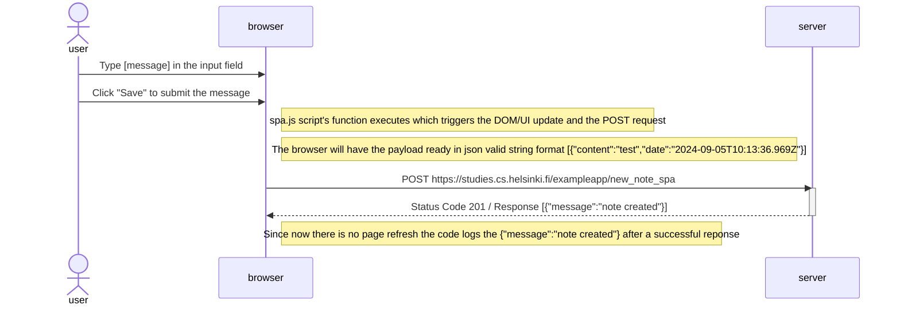

```mermaid
sequenceDiagram
    actor user
    participant browser
    participant server

    user->>browser: Type [message] in the input field

    user->>browser: Click "Save" to submit the message

    Note right of browser: spa.js script's function executes which triggers the DOM/UI update and the POST request
    Note right of browser: The browser will have the payload ready in json valid string format [{"content":"test","date":"2024-09-05T10:13:36.969Z"}]

    browser->>server: POST https://studies.cs.helsinki.fi/exampleapp/new_note_spa
    activate server
    server-->>browser: Status Code 201 / Response [{"message":"note created"}]
    deactivate server

    Note right of browser: Since now there is no page refresh the code logs the {"message":"note created"} after a successful reponse
```
